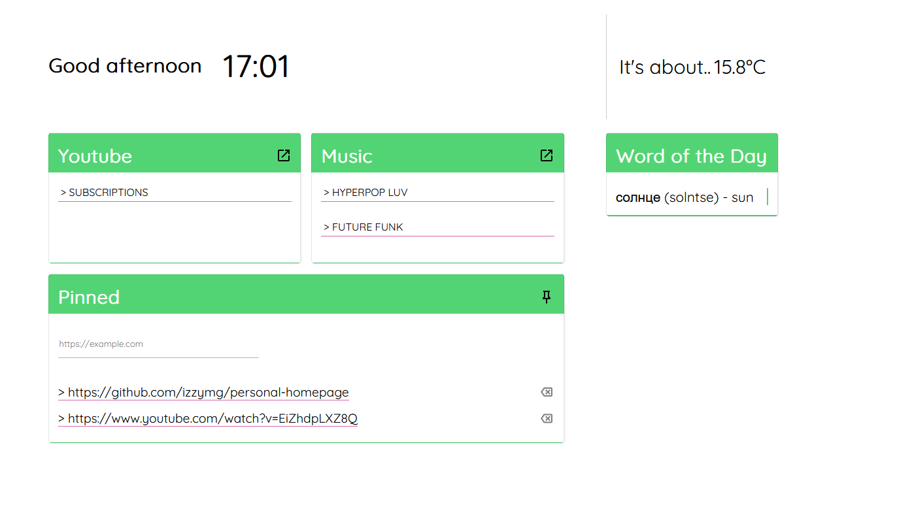
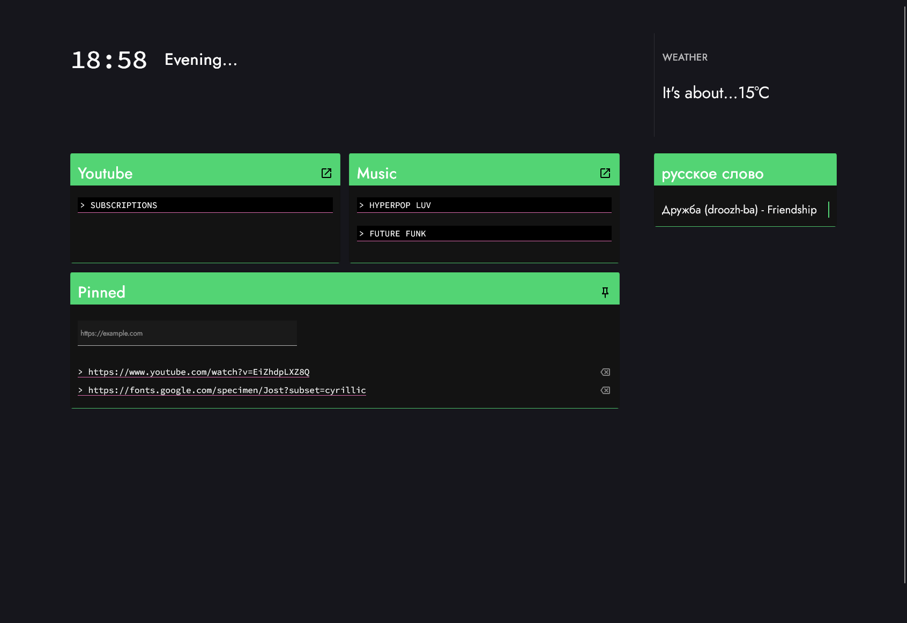

## Open API Key

The random word widget only works with an Open AI key!

1. Create `./assets/open-api-key.json`
2. Copy the following into it: `{"key":"YOURKEY"}`
3. Replace `YOURKEY` with your actual Open AI key
